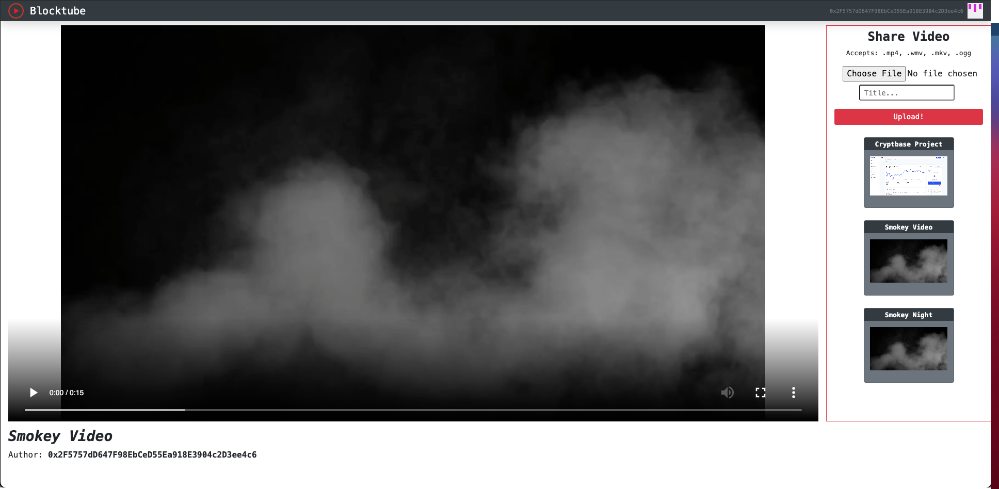

# Blocktube
[Live App Here](https://wellsniko.github.io/Blocktube/) (you must have a MetaMask Wallet)

Youtube is great, but with all data on the site being stored on Youtube's servers, Alphabet is able to do whatever they want with your profile, personal data, as well as censoring certain creators or videos. Blocktube is a decentralized video sharing application build on top of Ethereum's Ropsten Test Network.  

The site requires a MetaMask Wallet running on the Ropsten Test Network to view and share content. When you upload a video file onto Blocktube, your file is verified like a transaction and given a hash via the smart contract 0xad6a6c6c31f1b933bd515b14c052901dec640473, which you can find at https://ropsten.etherscan.io/address/0xad6a6c6c31f1b933bd515b14c052901dec640473, and the code under src/contracts in this repository. The user pays a gas fee in test ETH to upload their video file. 

All uploaded video files are stored on The InterPlanetary File System (IPFS), a protocol and peer-to-peer network for storing and sharing data in a distributed file system. IPFS is built around a decentralized system of user-operators who hold a portion of the overall data, creating a resilient system of file storage and sharing.

To get test ETH from a Ropsten Faucet, try the following links:
- https://faucet.ropsten.be/
- https://faucet.dimensions.network/
- https://app.mycrypto.com/faucet

And to get a MetaMask Ethereum Wallet, click [here](https://chrome.google.com/webstore/detail/metamask/nkbihfbeogaeaoehlefnkodbefgpgknn?hl=en)

